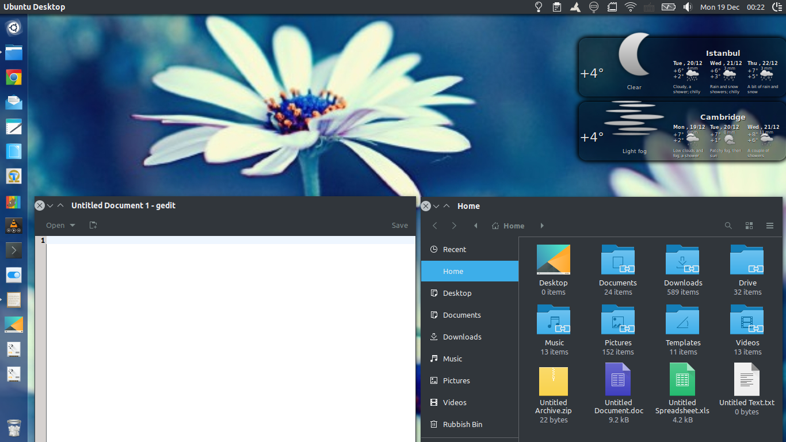

# Breeze-Dark GTK Theme with Unity support

This theme only required a (virtually empty) **metacity-1** and a **unity** sub-folder to be added for compatibility with Ubuntu's Unity Desktop Environment.

