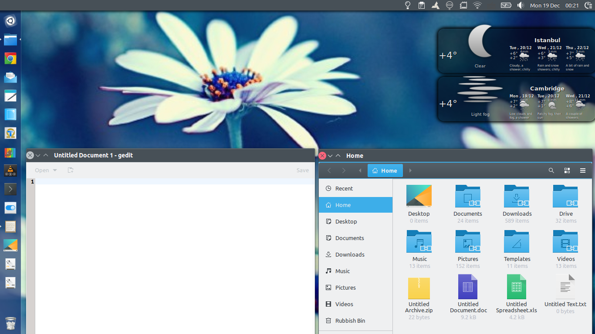

# Breeze GTK Theme with Unity support

This theme required a section for Unity window decorations and Unity Top Panel to be appended to **/gtk-3.20/gtk.css** in addition to a (virtually empty) **metacity-1** and a **unity** sub-folder for compatibility with Ubuntu's Unity Desktop Environment.

Note: For Ubuntu versions prior to 16.10 (GTK 3.20) the user should copy and paste this section also to **/gtk-3.0/gtk.css** and **/gtk-3.18/gtk.css** - perhaps with some additional tweaks.

