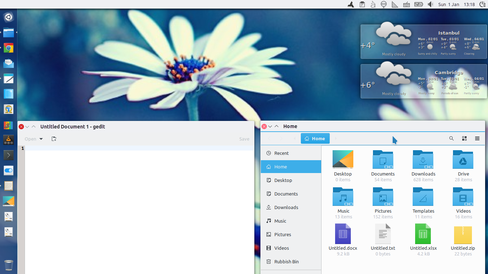

# Breeze-Light GTK Theme with Unity support

This **complementary** theme is based on the main Breeze GTK theme with the only difference that its titlebar, headerbar and Unity top panel are not dark, but have the same color as the toolbar. Therefore, it involves far more modifications than the other two: that's why it supports (at least for the time being) **GTK 3.20 only**.

